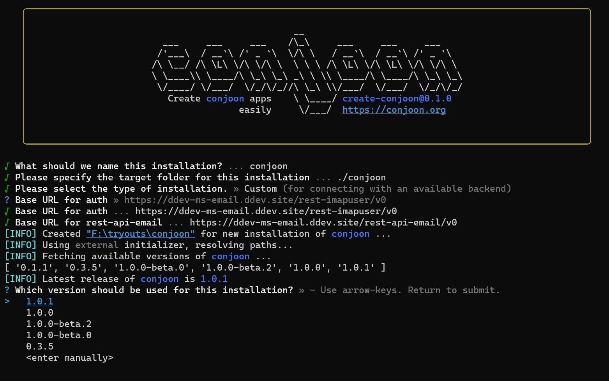

We're happy to announce **conjoon 1.0**, our very first major release.

For updating to the latest version, simply use our [**installer**](docs/api/misc/@conjoon/create-conjoon). 
It will let you select the latest release when opting for the version to install.



### Highlights

**v1.0.0** marks the first major release for our JavaScript Email frontend, over 100 tickets related 
to [bugfixes, optimizations and minor features](https://github.com/orgs/conjoon/projects/3) across all projects where
closed.

This release focuses on providing a stable frontend in conjunction with [**lumen-app-email**](./docs/api/backends/@conjoon/lumen-app-email).

Besides the features already introduced with the release candidates, the following features have been added:

#### Plugins
 - Plugin [**mail-internal-mailtohandler**](./docs/api/plugins/@conjoon/extjs-app-webmail/mail-internal-mailtohandler): 
Plugin for registering conjoon as the protocol handler for `mailto`-links


#### Installer and CLI actions for **lumen-app-email**
The installation for **lumen-app-email** has been simplified with the help of **Artisan** and CLI commands. To get
an instance of **lumen-app-email** running, use 

```bash
$ composer create-project conjoon/lumen-app-email {targetDir} {version}
```

which will start the installation process. For more information, refer to the [**official guide**](./docs/api/backends/@conjoon/lumen-app-email#installation-1).


#### Docker Container

[**ddev-ms-email**](./docs/api/backends/@conjoon/ddev-ms-email) has been updated to utilize the installer of **lumen-app-email**
and additionally provides integration options for **conjoon** so that the container can be used for serving both the backend
and the frontend. 

```bash
$ ddev create-conjoon
```

will start the installation of **conjoon**.  For more information, refer to the [**official guide**](./docs/api/backends/@conjoon/ddev-ms-email).


