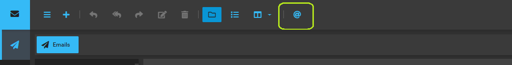
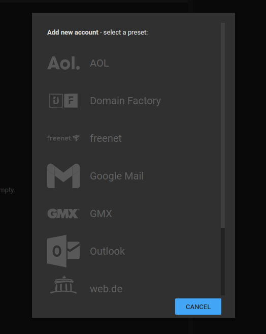
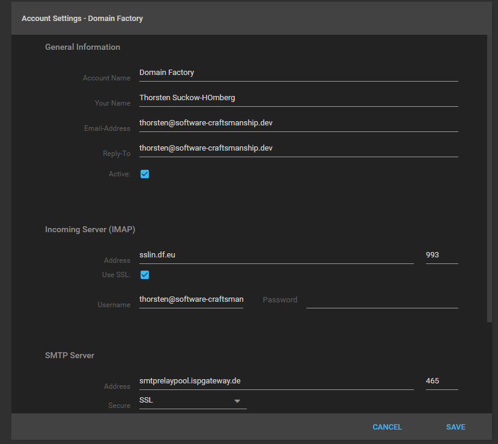

I'm happy to announce **conjoon 1.1.0**, a feature release that brings a lot of qol-improvements, bug fixes and a major feature to **conjoon**.

## Highlights

### **extjs-app-localmailaccount**
With the new authentication package [**extjs-app-localmailaccount**](/docs/api/packages/@conjoon/extjs-app-localmailaccount), you're now able to store multiple Email-Accounts directly on your computer. While the first major release of **conjoon** came bundled with [**extjs-app-imapuser**](/docs/api/packages/@conjoon/extjs-app-imapuser), an auth-package for authorizing against a single IMAP account (that was in particularly developed for free email hosters), this package now focuses on custom installations where users maintain their own instances of **conjoon**.


#### Enabling extjs-app-localmailaccount - Frontend:
The package comes bundled with **conjoon**, so there's nothing left to do for you except for enabling the package. Use the latest version of [**create-conjoon**](/docs/api/misc/@conjoon/create-conjoon) to ease the installation process - it allows you to copy an **official release** to the directory of your previous installation (make sure you read the documentation before you overwrite the directory contents, or if you'd rather get a dev environment for **conjoon** up and running).

Once you have updated, open [`conjoon.conf.json`](/docs/conjoon.conf.json), then look for the section where `extjs-app-imapuser` is configured. Add a property named `disabled` (if not already existing) and set this to `true`.

```json
{
    "extjs-app-imapuser": {
        "disabled": true
    }
}
```

For `extjs-app-localmailaccount`, set the property to `false`:

```json
{
    "extjs-app-localmailaccount": {
        "disabled": false
    }
}
```

:::caution missing configuration for extjs-app-localmailaccount
In case you have no `extjs-app-localmailaccount` existing with your `conjoon.conf.json`,
refer to the [**documentation**](/docs/api/packages/@conjoon/extjs-app-localmailaccount#what-goes-into-an-extjs-app-localmailaccount-configuration) and utilize the default configuration coming with the package.
:::

Once everything is set configured, restarting your instance of **conjoon** should now directly boot to the `MailDesktopView`. A new button will be available in its toolbar:



Clicking it will open up the `MailAccountWizard` that lets you choose from a set of pre-configured accounts: 



:::tip
You can also apply custom mail server information by scrolling down the list and pick the `"...other IMAP account"`-entry.
:::

Once you have provided the required details, the Email Account will be stored in the **Local Storage** of your browser. It is always editable afterwards by selecting the node prepresenting the Email Account from the `MailFolderTree` on the left side of the `MailDesktopView`: 



#### Enabling extjs-app-localmailaccount - Backend:
Please make sure you take a look at the updates that came with the available backends, namely [**lumen-app-email**](https://www.conjoon.org/docs/api/backends/@conjoon/lumen-app-email#configureapi) - you need to update to the latest version to make sure the updated client can properly communicate with the backend.
Make sure you apply the proper api-configuration to your backend instance.
Upgrading to a new version of **lumen-app-email** will also update to the latest version of [**php-lib-conjoon**](https://github.com/conjoon/php-lib-conjoon). Needless to say, **lumen-app-email** is fully backwards compatible.

### Supporting UI-State-management
I have added support for saving the state of the UI so you do not have to expand/collapse various views once you re-enter the application. This is a small qol-improvement for now. The initial support for this opens the door for more improvements in this regard.

## Other changes

Other notable changes include:

 - blocked bg-images do not trigger external content warning [conjoon/extjs-app-webmail#284](https://github.com/conjoon/extjs-app-webmail/issues/284)
 - replying to email fails after sorting a large grid [conjoon/extjs-app-webmail#270](https://github.com/conjoon/extjs-app-webmail/issues/270)
 - onMailDesktopViewShow's internal callback cancels events [conjoon/extjs-app-webmail#283](https://github.com/conjoon/extjs-app-webmail/issues/283)
 - opening a message with erroneous key-fragments triggers error [conjoon/extjs-app-webmail#282](https://github.com/conjoon/extjs-app-webmail/issues/282)
onMailAccountActiveChange triggers error if editor with error state is opened [conjoon/extjs-app-webmail#274](https://github.com/conjoon/extjs-app-webmail/issues/274)
- child-folders not loaded when MailDesktopView is not opened via route [conjoon/extjs-app-webmail#256](https://github.com/conjoon/extjs-app-webmail/issues/256)
 - icons for mail folder missing upon first expand [conjoon/extjs-app-webmail#281](https://github.com/conjoon/extjs-app-webmail/issues/281)
 - error thrown when MailAccountWizard is destroyed and configs are loaded [conjoon/extjs-app-webmail#280](https://github.com/conjoon/extjs-app-webmail/issues/280)
 - reading pane button enabled when MailAccountWizard is active [conjoon/extjs-app-webmail#278](https://github.com/conjoon/extjs-app-webmail/issues/278)
 - protocol handler for mailto does not consider instance's pathname [conjoon/extjs-app-webmail#268](https://github.com/conjoon/extjs-app-webmail/issues/268)
 - button for toggling gridlist gets activated when MailAccountWizard is shown [conjoon/extjs-app-webmail#277](https://github.com/conjoon/extjs-app-webmail/issues/277)
