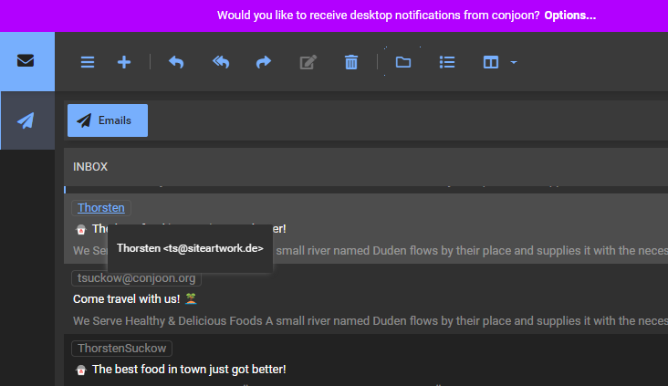

I have just release **conjoon 1.2.1**, which is a maintenance release with a focus on the handling of email addresses in routing and general views such as the **Inbox View**, the **editor** and the **message view**.

## View related Email Address handling 

The new release provides more detailed information about the email address of the recipient or the sender when viewing an email in a related view - this also includes lists where **email messages** appear:  
You're now able to inspect the email address by hovering over the address-element which will then present the full address (incl. the recipient's/sender's name, if available). Also, new messages can now directly be composed by clicking an email address present in any of such views.

Additionally, the routing has been updated to be more generous when it comes to parsing email addresses: Routes like `#cn_mail/message/compose/mailto%3Atsuckow%40conjoon.org%20<tsuckow%40conjoon.org>`
now properly create a new message for the recipients specified in the route, in this case `tsuckow@conjoon.org <tsuckow@conjoon.org>`.

### Changes to the application engine

**extjs-lib-core** now allows for package configurations using the semantic complement of `disabled`: Users who wish to use `enabled` instead [can now do so](/docs/conjoon.conf.json#enabled).

## All Notable changes

The notable changes for this release include:

 - refactor: update styles for email addresses in headers to indicate interactivity [conjoon/extjs-app-webmail#302](https://github.com/conjoon/extjs-app-webmail/issues/302)
 - feat: show email address as tip for tag field of email address [conjoon/extjs-app-webmail#292](https://github.com/conjoon/extjs-app-webmail/issues/292)
 - fix: MailAddress-name quoted multiple times [conjoon/extjs-app-webmail#287](https://github.com/conjoon/extjs-app-webmail/issues/287)
 - feat: show tooltip for addresses in MessageView's header [conjoon/extjs-app-webmail#293](https://github.com/conjoon/extjs-app-webmail/issues/293)
 - refactor: change EmailAddressField to "createNewOnBlur=true" [conjoon/extjs-app-webmail#306](https://github.com/conjoon/extjs-app-webmail/issues/306)
 - feat: allow for passing `name <address>` to compose-url with mailto [conjoon/extjs-app-webmail#290](https://github.com/conjoon/extjs-app-webmail/issues/290)
 - feat: make addresses in message grid clickable [conjoon/extjs-app-webmail#291](https://github.com/conjoon/extjs-app-webmail/issues/291)
 - refactor: change "disabled" to "enabled" for package configurations and add defaults to configs [conjoon/conjoon#29](https://github.com/conjoon/conjoon/issues/29)

 