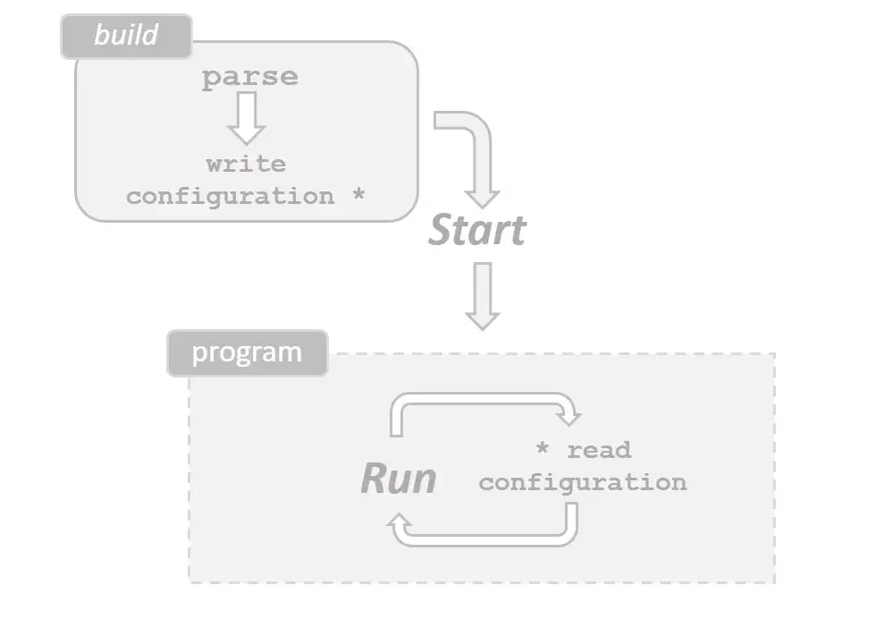

Dependency Injection in Conjoon
==================================

Configuring conjoon's IoC-Container for using Constructor Injection
----------------------------------------------------------------------

:::tip
With **conjoon**, you are able to configure the dependencies of your classes upfront and inject them dynamically during runtime. This guide gives details on how to use the IoC-Container that comes with conjoon.
:::

:::info
This guide originates from the blog article [Dependency Injection in JavaScript](https://medium.com/@thorstensuckow/dependency-injection-in-javascript-7f85dae43121).
:::

Motivation
==========

_Low coupling_ and _high cohesion_ does not imply the total absence of associations: The usage of abstraction layers rightfully demands specifics that provide concrete implementations satisfying contracts between parts of a system. After all, a program doesn’t work if there is nothing that conforms to its _Interfaces_ and _Abstract Classes_.


**Figure 1** _The most basic expectation regarding a computer program is that a given input produces some output._

However, the way these dependencies are wired throughout source code often comes with a bitter taste: Dependencies are found in convoluted and deeply nested program code, effectively violating [SRP](https://en.wikipedia.org/wiki/Single-responsibility_principle) and [DIP](https://en.wikipedia.org/wiki/Dependency_inversion_principle).

We are in the need of tools and design patterns that can help us with detangling the code, or we will end up with a program that has intricate boilerplate code for setting up mocks and stubs for testing, or worse: Becomes a nightmare to integrate with different environments and infrastructures. Granted, languages like _JavaScript_ makes it easy to mock dependencies during tests, but other languages are not so forgiving and test cases tend to get more complicated the more dependencies are hardwired.

The following source code was taken from a _REPOSITORY_\-implementation that uses a concrete `Storage`\-class that hides away infrastructure that is used for writing data:

```javascript
class DataRepository {

    async storeDate(data) {
         const  {Storage} = await import("storageApi");

         const store = new Storage(...);

         store.save(data);
    }

}
```

It seems to align nicely with our code standards — it’s small, it explains its intends clearly without additional comments, and it delegates to a sub-program responsible for communicating with infrastructure that is not of interest to us.

However, this method uses a hardwired dependency to `serverApi` which gets imported as a _module_. Even more, everything the constructor of `Storage` requires has to be handled from inside the `storeData()`\-method. For testing this code, the developer has to create a _Mock_ not only for `Storage`, but also needs to stub the call to `import`. The _DataRepository_ directly accesses the low-level API from within its boundaries, which results in strong coupling between two different layers that actually should be unaware of each other.


**Figure 2** _The “DataRepository” directly accessing “Storage” creates strong coupling between two concretes that should be unaware of each other._


> The Dependency Inversion Principle requires high-level modules to not import anything from low-level modules. This is one of the [_SOLID_ design principles](http://butunclebob.com/ArticleS.UncleBob.PrinciplesOfOod).


**Figure 3** _The “DataRepository” is configured with the “Storage”-instance. Now, the repository can focus on using the Storage’s public API and doesn’t have to take care of importing and configuring it. In tests, the API of the “Storage”-instance can easily be mocked._

This article introduces an [Inversion of Control](https://martinfowler.com/articles/injection.html#ConstructorInjectionWithPicocontainer) (_IoC_)-Container that decides _during runtime_ if code has additional dependencies defined, and if any existing dependency should be resolved by the IoC-Container. This is realised through _bindings_ configured by a client and passed to the the IoC-Container: These provide information for the _concrete_ that has to be instantiated for a _type,_ i.e. an _Interface,_ or any _(Abstract) Class_,  required by an arbitrary host.

_Bindings_ can be used and adjusted application-wide, but it’s good practice to provide them during bootstrapping. This makes it easy to run programs with different implementations for selected clients, contexts or environments, and this all works without having to change a single line of low/high-level code at all.


**Figure 4** _Our Proxy wraps the constructors of selected target classes and injects dependencies with arguments as needed._

_Proxies_ help with the implementation of resolving objects and dependencies, and this approach is not exclusive to JavaScript: For example, [Java](https://docs.oracle.com/javase/10/docs/api/java/lang/reflect/Proxy.html) has Proxies, [Spring](https://docs.spring.io/spring-framework/docs/3.2.x/spring-framework-reference/html/beans.html) uses them for its IoC and [AOP](https://en.wikipedia.org/wiki/Aspect-oriented_programming).

If you need to catch up with the concept of Proxies and how they work in JavaScript, I recommend you read through [this elaborate article](https://medium.com/@thorstensuckow/a-fluent-interface-for-javascript-promises-372ffc40e051) that provides details on how to use Proxies with [_Promises_](https://developer.mozilla.org/en-US/docs/Web/JavaScript/Reference/Global_Objects/Promise) to create [Fluent Interfaces](https://martinfowler.com/bliki/FluentInterface.html).

For the following examples, I will constantly refer to the IoC-Container implementation of [**coon.core.ioc**](https://github.com/coon-js/extjs-lib-core/tree/main/src/ioc): This is an implementation specific for the Sencha Ext JS framework, but it’s concepts can easily be carried over to other frameworks or framework agnostic code.

How it works
============

Target classes need to provide information if they are _injectable_, i.e. if they should be considered by the _IoC-Container_ during instantiation. This is needed because we want to autowire dependencies to keep our program as flexible as possible: The IoC-Container gets configured with bindings during the startup sequence, then takes care of publishing the configured types with their concrete implementations during the runtime of the application.


**Figure 5** _The IoC-Container will take care of dynamically resolving dependencies for a concrete instance that is required by the client._

Most programming languages and their platforms already provide the tools for handling additional information written with source code: _Metadata_ is often created with the help of [annotations in Java](https://jcp.org/en/jsr/proposalDetails?id=175), or [Attributes in PHP8](https://www.php.net/manual/en/language.attributes.overview.php).

Metadata: Static builds vs. runtime configuration
-------------------------------------------------

With the almost incomprehensible amount of tooling options for JavaScript, using annotations would probably cost little effort; however, it would most certainly mean that the build stack of our project changes: An additional tool that has the implementation for parsing our source code also extracts and translates metadata and makes sure that the resulting build does not break during runtime.

An annotation in the form of

```javascript
/\*\*
 \* @injectable store:Storage
 \*/
class Repository {
   ...
}
```

would be useful, and additional annotations can be defined in some sort of dictionary.

The parser could then build configuration files out of the metadata found in the sources, connect them with the names of the target classes (and the paths to the imports), along with the properties (i.e. names of the instance variables of the target classes) which expect a particular type, and then plug it all together by applying the bindings configured by the developers and stored in the IoC-Container.


**Figure 6** _Using annotations with JavaScript code would require a separate build step in the ci/cd pipeline._

We strive for an implementation that does not need such additional tooling: We will provide the **_metadata_** as **static class members** on top of the injectable classes.

The following source code demonstrates the use of the [`static`-property](https://developer.mozilla.org/en-US/docs/Web/JavaScript/Reference/Classes/static): A property named `required` is the root for the _meta information_ looked up by the IoC-Container and its _Dependency Resolver_: It holds all the names of the instance variables that expect specifics of a given type: In the example, an instance of `Repository` only works with a `store`\-member that holds a reference to an instance of `Storage`.

```javascript
class Repository {
   static: {
      required: {
        store: "Storage"
      }
   }

   ...
}
```

With the help of the [**Proxy**\-Api](https://developer.mozilla.org/en-US/docs/Web/JavaScript/Reference/Global_Objects/Proxy/Proxy), we can then [add a trap for the calls to the constructor](https://developer.mozilla.org/en-US/docs/Web/JavaScript/Reference/Global_Objects/Proxy/Proxy/construct) of the _injectable_ classes, in this case the `Repository`\-class:

```javascript
class Repository {
   static: {
      required: {
        store: "Storage"
      }
   }

   constructor({store}) {
       this.store = store;
   }

   ...
}


const constructorHandler = {

    construct (target, argumentsList, newTarget) {
        if (target.required) {
            // container holds a reference to the ioc-container
            container.inject(argumentsList, target.require);
        }

        return new target(...argumentsList);
    }

};


Repository = new Proxy(Repository, constructorHandler)

```

The handler will delegate to the IoC-Container before the instance of the target class is created: The IoC-Container then inspects the argument-list and looks for any missing properties in a previously contracted argument-object that’s used to configure the instance. Denoted by the `required`\-property, the instance variable’s name must be the same as the configuration object containing the property needed by the constructor:

```javascript
// IoC-container will not inject anything, since the instance gets configured
// with a "store"-property
new Repository({store: new Storage(), uri: "/resourceUri"});


// since the "store"-property is missing, the IoC-container will
// inject a concrete of "Storage" according to the available bindings
new Repository({, uri: "/resourceUri"});
```

Creating the Bindings
=====================

Bindings are the Point of Truth for our application since we rely on builders and resolvers that are configured upfront and take care of assembling associations during runtime. _Bindings_ map concrete _Sub Types_ to _Types,_ means: They “bind” a _typed_ variable to the specific implementation of the _Type_, so our IoC-Container knows _what_ to apply and _where_ to apply it (the _when_ is implied by the usage of a **_Constructor_** _Injector_). The requested _specific_ implements an interface or extends an (abstract) class and the [LSP](https://en.wikipedia.org/wiki/Liskov_substitution_principle) gives us the freedom to provide arbitrary implementations of this given _Type_.

> If for each object o1 of type S there is an object o2 of type T such that for all programs P defined in terms of T, the behavior of P is unchanged when o1 is substituted for o2, then S is a subtype of T. — [Barbara Liskov](https://en.wikipedia.org/wiki/Barbara_Liskov), [**Data Abstraction and Hierarchy**](https://dl.acm.org/doi/pdf/10.1145/62139.62141)

Since we are loosely typed, our _Dependency Resolver_ (think of it as sort of a _Builder,_ ) must and will make sure that our specifics are indeed instances of the required type.

Finding a common language
-------------------------

We will introduce a model language that will help us with formulating the bindings needed throughout our program.

We have a class **A** that uses an instance of a class **B**:


**Figure 7** _A needs B._

The code for

“**A** has a dependency to Type **B,** and this dependency is reflected in **A**’s instance variable **b”**

could look like this:

```javascript
// Pseudo code

abstract class B {
    abstract calculate();
}


class A {

    constructor (B b)
    {
      this.b = b;
    }


    calculation()
    {
        this.b.calculate();
    }
}
```

Obviously, sources that rely on **A** will not work without an **_\[instanceof A\]_.b** — as soon as `calculation()` delegates to `b.calculate()`and **b** is `undefined`, an exception will be thrown.

We are looking for a formal (yet simple) definition that can be used with JavaScript to configure these dependencies: We’ll agree on JSON as the format, since it allows for key/value-pairs whereas the keys are of type `string` and their values can be any of `string`, `integer`, `boolean`, `NULL`, `object` and `array` — we’ll make use of `string` and `object`.

Let’s refine the task for resolving the dependencies of **A**:

```
**when** A
  **requires** B
  **give** _new instance_ of B
```

That’s a rather simple term which will be translated later into an assignment by the _Dependency Resolver_. For now, this is how it’s transposed to JSON (don’t mind the explanatory comments):

```json
 {
    /\* when \*/
    "A": {
      /\* "needs": "give" \*/
      "B" : "InstanceOfB"
    }
}
```

Use Case: Injecting Authentication Methods
------------------------------------------

With `coon.core.ioc` as part of a coon.js-application, here’s a typical call to `coon.core.ioc.Container.bind()`:

```javascript

// Some class names have been shortened in favor of
// readability.
coon.core.ioc.Container.bind({
        "conjoon.dev.cn\_mailsim": {
            "conjoon.SimletAdapter": "conjoon.BasicAuthSimletAdapter"
        },
        "conjoon.cn\_mail": {
            "coon.core.data.request.Configurator": {
                "$ref": "#/$defs/RequestConfiguratorSingleton"
            }
        },
        "$defs": {
            "RequestConfiguratorSingleton": {
                "xclass": "conjoon.cn\_imapuser.data.request.Configurator",
                "singleton": true
            }
        }

});
```

This configuration represents bindings of the [**extjs-app-imapuser**](https://github.com/conjoon/extjs-app-imapuser)**\-**package, an npm package providing user authentication for [conjoon’s](https://www.conjoon.org/) [**extjs-app-webmail**](https://github.com/conjoon/extjs-app-webmail), which is an email client written in JavaScript.


_The Login-Screen for the JavaScript webmail client used in conjoon, depending on the authentication module configured with this instance._


**extjs-app-webmail** communicates with a backend that is agnostic of the authentication being used — its architecture allows for guarding the endpoints with arbitrary authentication methods: It could be _Basic_ access authentication, or the API could use a guard that relies on token based authentication. That is why the requesting client — in this case **extjs-app-webmail** — needs to be configured with the proper security technique the backend understands. This is done by using _Request Configurators_ that hook into (some/all/none at all) outgoing requests and add the authentication information if required by the backend, e.g. a `Authorization`\-header field, holding `Bearer`\- ,`Basic`\- or other information.

Bindings explained
------------------

Let’s have a detailed look at the given binding configuration. First of, the bindings configured here are introduced with namespaces instead of class names. This is just another way of defining bindings for a **set** of classes owned by a namespace (i.e. a whole _module_): Instead of individually defining dependencies for

`conjoon.dev.cn_mailsim.A`, `conjoon.dev.cn_mailsim.B`, `conjoon.dev.cn_mailsim.C`, …

we fall back to their common namespace, so the _Dependency Resolver_ can look up bindings configured for this module when a target class is not explicitly specified in the configuration. Target classes are always given precedence, then namespaces are queried.

The same goes for the following section, albeit the value of the _give_\- implication is not the name of a class: It’s a configuration that _references_ another _section_.

```json
 "conjoon.cn\_mail": {
      "coon.core.data.request.Configurator": {
         "$ref": "#/$defs/RequestConfiguratorSingleton"
     }
  }
```

Based on the [JSON-schema specification](https://json-schema.org/draft/2020-12/json-schema-core.html#name-schema-references), `$ref` uses an _URI_ to reference another section of the document it’s embedded in, which allows for defining a reusable, complex configuration at one place, then re-use this configuration throughout the document by referencing it.

The (resolved)`$ref` in the above example states that

```
**when** any class of conjoon.cn\_mail
  **requires** coon.core.data.request.Configurator
  **give** _Singleton_ of conjoon.cn\_imapuser.data.request.Configurator
```

Singletons are great when stateless objects are needed, and reduce the memory footprint in a target application.

Resolving dependencies — trapping the Factories
===============================================

The class-system of Sencha Ext JS makes — almost exclusively — use of Factories when instances are created. This is useful for dynamically loading classes: Its _microloader_ will take care of mapping class-names to the existing directory-structure of a project, but loading happens synchronously (in the worst case, if a class was not pre-loaded). Using Sencha Ext JS without it’s own class system is almost impossible. In some cases, this is an unpleasant surprise for users starting with Ext JS in 2022.


**Figure 8** _Sencha Ext JS Factory methods take care of resolving dependencies and instantiating objects._

However, the use of factories and factory methods throughout the framework makes it really easy to apply Proxies to them and plays into our hands with our constructor injection approach. Carefully selecting constructors of injectable target classes becomes obsolete and we can rely on the interiors of the framework when we have to decide if dependencies need to be injected.

A _Wrapper_\-Proxy is installed as soon as `coon.core.ioc.Container.bind()` is called:

```javascript
 installProxies () {
        const me = this;

        Ext.Factory = new Proxy(
            Ext.Factory,
            Ext.create("coon.core.ioc.sencha.resolver.FactoryHandler")
        );

        Ext.create = new Proxy(
            Ext.create,
            Ext.create("coon.core.ioc.sencha.resolver.CreateHandler")
        );
    },
```

There are two Proxy-Handlers that serve two different purposes. Let’s have a look at them:

**Handler for Ext.create**

The **_CreateHandler_** is a method that traps calls to `Ext.create`. It checks if the argument passed to `Ext.create()` is

*   a _String_: If that is the case, it’s assumed to be the name of the class an instance should be created for
*   an _Object_: This generally indicates that the client submits a configuration, holding an `xtype` or `xclass` providing further details on the class that serves as the template. All the properties the object contains are usually passed to the constructor of the target class, except for `xtype`/ `xclass`

```json
{
    "xtype": "alias-of-class",
    // or "xclass": "fqn.of.class"
    "cArg1": "foo",
    "cArg2": "bar"
}
```

As **Figure 9** shows, once the target class was successfully resolved given the internals of Ext JS, the handler fires the `classresolved`\-event, along with information about the class name and the JavaScript _prototype_ of the resolved class.


**Figure 9** _The Handler installed for Ext.create fires an event as soon as a class was successfully resolved._

**Handler for Ext.Factory**

The **_FactoryHandler_** implements traps for properties requested by a client (using `[get](https://developer.mozilla.org/en-US/docs/Web/JavaScript/Reference/Global_Objects/Proxy/Proxy/get)`) and a trap for any method that could possibly be a _factory method_.

Factory methods are based on types that get published with class definitions. Aliases are constantly used throughout Sencha Ext JS and facilitate lazy instantiation. Those aliases are using prefixes which represent the domain they serve, for example, aliases for `Ext.data.Store` have the prefix `"store.”`, `Ext.app.Controller` use the prefix `"controller.”` [and so on](https://docs.sencha.com/extjs/7.6.0/classic/Ext.Class.html#cfg-alias).

The **Ext.Factory** wires these configurations through to the corresponding _factory methods_, and that’s where the apply-handler previously installed by the `get`\-handler comes into play: It works just like the **_CreateHandler_** and differs only in subtle details when arguments to the factory methods are scrutinized. In the end, this proxy will trigger the `classresolved`\-event for the same reason as its complement.

```javascript
if (cls) {
    const className = Ext.ClassManager.getName(cls);
    me.fireEvent("classresolved", me, className, cls);
}
```

Proxying the constructors
=========================

It all boils down to the **_ConstructorInjector_**: Once the `classresolved`\-event is published, the **_ConstructorInjector_** is used with an observer to decide whether it should inject dependencies into the target class’ constructor (the information about the target class is exposed with the _event details_). It checks whether the class is _injectable_ and if that’s the case, it will apply a trap for the target class’ constructor.

Think of the _Strategy Pattern_ here that allows us to dynamically change implementation details. It should be noted that the **_ConstructorInjector_** is working on _objects_ passed to the _constructor_ as _arguments_, rather than a list of arguments_._ So the **_ConstructorInjector_** is more of a _Property Injector_. The name was chosen since **_ConstructorInjector_** better reflects the step in the build chain the injector is woven into: The implementation for the Sencha Ext JS framework is kept simple and provides mainly (but not less than) qol-improvements for this framework.

The trap for the constructor will probe the target class for all the dependencies required (defined as _metainformation_), then use the _Dependency Resolver_ to create something useful out of the binding definition that was previously registered with `coon.core.io.Container.bind()`.


**Figure 10** _When the client requests a new instance, the ConstructorInjector will make sure that dependencies required by the target instance are created and injected, if not already specified by the client._