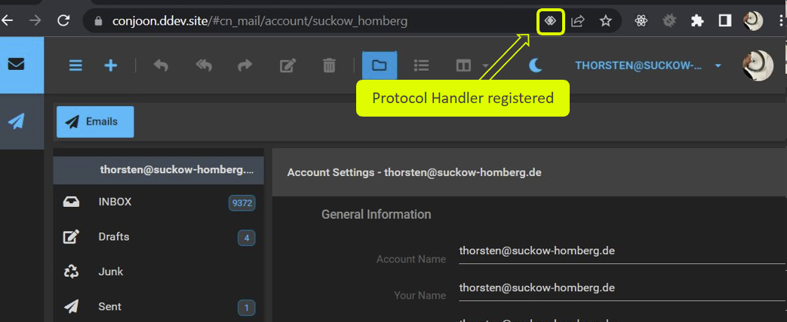
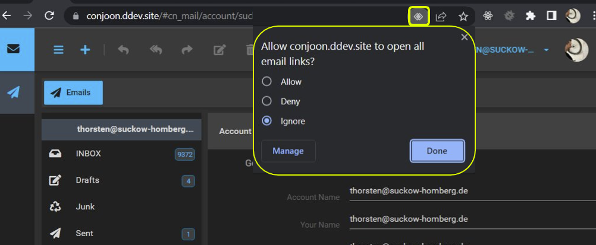

:::caution Internal Plugin
This is an internal plugin defined by **[extjs-app-webmail](/docs/packages/extjs-app-webmail.md)**.
:::

[Controller Plugin](/docs/plugins/overview.md#controller-plugins) for registering **extjs-app-webmail**
as a [protocol handler](https://developer.mozilla.org/en-US/docs/Web/API/Navigator/registerProtocolHandler/Web-based_protocol_handlers) for `mailto`-links.

## Use this plugin, if you...
- want to use **extjs-app-webmail** as the default email client that processes user interactions with `mailto`-links

# Requirements
This package only works if **extjs-app-webmail** is used in a secured context, i.e. the website integrating **extjs-app-webmail**
uses encrypted `http`-client/server communication (**SSL**/**TLS**; `https`).

## Installation

:::info
This plugin is automatically installed with **[extjs-app-webmail](/docs/packages/extjs-app-webmail.md)** and _enabled_ by default.
:::


## Configuration

### Enabling / Disabling the plugin

The plugin can be enabled by adding an entry with the field `xclass` set to `conjoon.cn_mail.app.plugin.MailtoProtocolHandler` in the [`plugins/controller`](/docs/packages/extjs-app-webmail.md#plugins)-section:

```json title=conjoon.conf.json
{
    "packages": {
        "extjs-app-webmail": {
            "plugins": {
                "controller": [{
                    "xclass": "conjoon.cn_mail.app.plugin.NewMessagesNotificationPlugin",
                }]
            }    
        }
    }
    
}
```

To disable the plugin, remove its entry from this section.

### Using this plugin
:::info
We'll be using `Google ChromeV107.0.5304.107` for this example.
:::

Once this plugin was properly recognized by the browser, you will see a new icon appearing to the right side of the
address bar:



The new icon indicates that the website is asking for permission to register itself as a protocol handler. Click the
icon to see more details.



Click **Allow**. You can always remove the web-app using **extjs-app-webmail** as the protocol handler by typing into
the address bar:

```
chrome://settings/handlers
```

This will open up the _Protocol handlers_ setting page of Chrome, providing further configuration options for this
setting.
